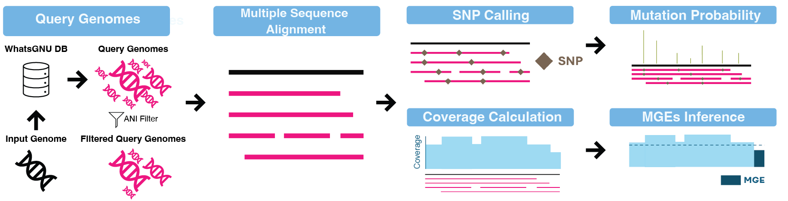
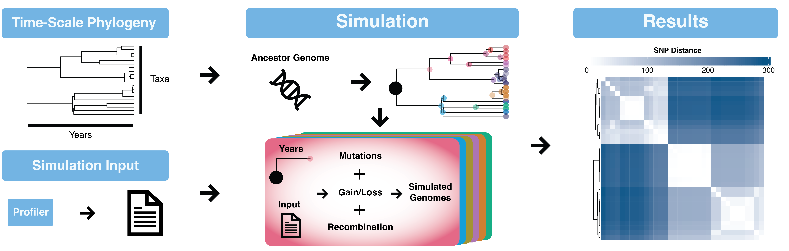

# SILOSim
A data-driven framework that profiles per-site bacterial genome variability and simulates evolution from it. From a single genome assembly, SILOSim builds a map of per-site entropy and mobile genetic elements, then runs forward-time simulation weighted by observed variation.

## **Graphical Workflow** 
### **[Profiler](docs/usage_profiler.md)**

### **[Simulator](docs/usage_simulator.md)**

## **Development Status**
Please be advised that this pipeline is still in its early development stage. It is subject to significant changes in terms of options, outputs, and other functionalities. Users should be prepared for potential modifications and updates in future releases.

## Documentation
### Getting Started
- [System Requirements](docs/requirements.md)
- [Installation](docs/installation.md)
- [Quick Start](docs/quick_start.md)
### Modes
- [Profiler](docs/usage_profiler.md)
- [Simulator](docs/usage_simulator.md)
### Advanced Usage
- [Conda Environment Management](docs/conda_environment_management.md)
- [Resuming Interrupted Runs](docs/resuming_interrupted_runs.md)

## Authors

**Qianxuan (Sean) She**

## Acknowledgments
Developed under the mentorship of:

**Dr. Paul J. Planet**  
Email: planetp@chop.edu

**Dr. Ahmed M. Moustafa**  
Email: moustafaam@chop.edu

**Dr. Joseph P. Zackular**  
Email: joseph.zackular@pennmedicine.upenn.edu
##
